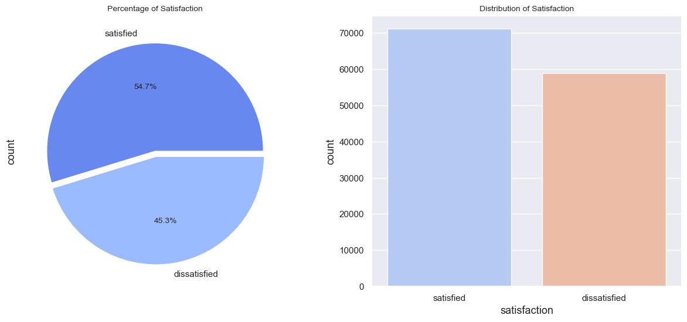
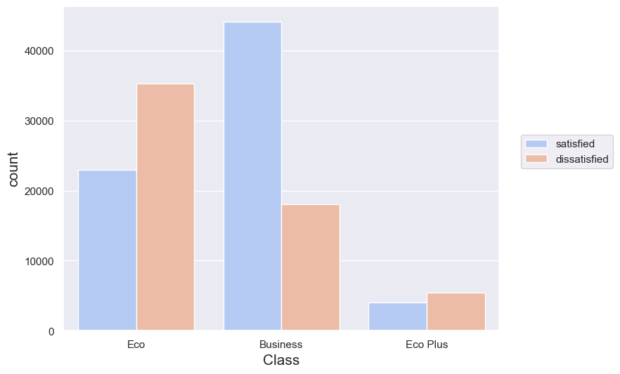
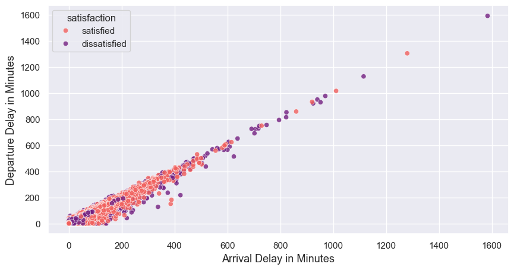

# ✈️ Airline Passenger Satisfaction Analysis

A comprehensive Exploratory Data Analysis (EDA) project that investigates airline passenger satisfaction using Python. The project identifies the factors that influence customer satisfaction, analyzes passenger demographics, travel behavior, delays, and service ratings, and provides actionable business recommendations for improving customer experience.

---

## 📌 Project Objective

The primary objective of this project is to analyze airline passenger data to understand the key drivers of customer satisfaction and identify areas where airlines can improve service quality.

The analysis aims to answer questions such as:

- What factors influence passenger satisfaction the most?
- Does travel class impact customer satisfaction?
- How do arrival and departure delays affect passengers?
- Which customer segments are more likely to be dissatisfied?
- What business insights can airlines use to improve customer retention?

---

## 📂 Dataset

The dataset contains airline passenger information including:

- Passenger Demographics
- Customer Type
- Type of Travel
- Flight Distance
- Travel Class
- Arrival Delay
- Departure Delay
- In-flight Service Ratings
- Overall Passenger Satisfaction

---

## 🛠️ Tech Stack

- Python
- Pandas
- NumPy
- Matplotlib
- Seaborn
- Jupyter Notebook

---

## 📊 Exploratory Data Analysis

The notebook performs:

- Data Cleaning
- Missing Value Handling
- Data Exploration
- Univariate Analysis
- Bivariate Analysis
- Multivariate Analysis
- Business Insight Generation

---

# 📈 Dashboard & Visualizations

## Passenger Satisfaction Distribution

<p align="center">

</p>

---

## Passenger Class vs Satisfaction

<p align="center">

</p>

---

## Arrival Delay vs Departure Delay

<p align="center">

</p>

---

# 🔍 Key Findings

### Overall Satisfaction

- Approximately **55%** of passengers are satisfied.
- Around **45%** remain dissatisfied, indicating significant room for improvement.

---

### Travel Class

- Business Class passengers have the highest satisfaction rate.
- Economy Class contributes the largest share of dissatisfied passengers.
- Eco Plus performs better than Economy but still trails Business Class.

---

### Flight Delays

- Arrival Delay and Departure Delay show a **very strong positive correlation**.
- Flights delayed at departure are highly likely to arrive late as well.
- Large delays have a direct negative impact on customer satisfaction.

---

### Customer Behavior

- Loyal customers tend to report higher satisfaction levels.
- Business travelers generally rate services more positively than personal travelers.

---

### Service Quality

The following services appear to have the strongest influence on passenger satisfaction:

- Seat Comfort
- Inflight Entertainment
- Online Boarding
- Leg Room Service
- Cleanliness
- Inflight Wi-Fi
- Food & Drink Quality

---

# 💡 Business Recommendations

### Improve Economy Experience

- Upgrade seating comfort
- Improve food quality
- Enhance entertainment options
- Reduce waiting times

---

### Reduce Flight Delays

- Improve scheduling
- Increase operational efficiency
- Enhance communication during delays

---

### Strengthen Loyalty Programs

- Reward frequent flyers
- Provide personalized offers
- Improve customer retention strategies

---

### Focus on Service Quality

Invest more resources into:

- Cabin cleanliness
- Crew responsiveness
- Boarding experience
- Inflight entertainment
- Wi-Fi connectivity

---

# 📋 Conclusion

The analysis demonstrates that passenger satisfaction is influenced by a combination of operational performance and service quality.

Key conclusions include:

- Flight delays significantly reduce customer satisfaction.
- Business Class consistently delivers the best customer experience.
- Economy passengers represent the greatest opportunity for service improvement.
- Loyal customers exhibit substantially higher satisfaction.
- Investments in service quality and operational efficiency can significantly improve customer retention and overall satisfaction.

Overall, this project provides actionable insights that airlines can leverage to enhance customer experience and strengthen long-term loyalty.

---

# 📁 Project Structure

```
AirlinesEDA/
│
├── Airlines_analysis.ipynb
├── airlines.csv
├── ArrivalvsDeparture.png
├── classVsSatisfaction.png
├── satisfaction_distribution.png
└── README.md
```

---

# 🚀 Future Improvements

- Customer Satisfaction Prediction using Machine Learning
- Feature Importance Analysis
- Interactive Power BI Dashboard
- Customer Segmentation
- Delay Prediction Model
- Flight Recommendation System

---

## ⭐ If you found this project useful, consider giving it a star!
